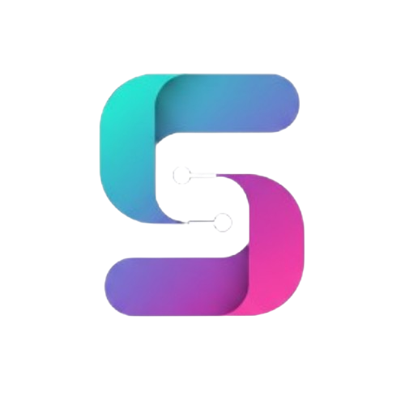

  
  <h1>Syncboard</h1>
  

    A real-time, collaborative whiteboard application built with the MERN stack, WebSockets, and Redis for a seamless, multi-user experience.
  

  
  

    
  

---

## ✨ Key Features

- **🎨 Real-Time Collaboration**: Draw, create shapes, and see other users' cursors move instantly using WebSockets.

- **🛠️ Full-Featured Toolbar**: Includes pencil, eraser, line, rectangle, and circle tools with adjustable color and brush size.

- **🔐 Secure User Authentication**: Complete system for registration, login, and password recovery with JWT and a Redis-based token 

blacklist for secure logouts.

- **💾 Autosave to Cloud**: Whiteboards are automatically saved to MongoDB after a pause in drawing.

- **🗂️ Project Management**: View all saved projects in a responsive carousel, with options to reopen, rename, and delete boards.

- **🔗 Invite System**: Generate unique "Co-board" links to start private, multi-user collaborative sessions.

- **🌙 Modern UI/UX**: A beautiful, responsive dark-purple theme built with Tailwind CSS, featuring glassmorphism and on-scroll animations.

## 🛠️ Tech Stack

### **Frontend**
| Technology | Description |
|------------|-------------|
| **React.js** | ⚛️ A JavaScript library for building user interfaces. |
| **React Router** | 🚦 For client-side routing and navigation. |
| **Tailwind CSS** | 🎨 A utility-first CSS framework for styling. |
| **Framer Motion**| ✨ For declarative animations. |
| **Socket.IO Client** | 🔌 For real-time WebSocket communication. |
| **Axios** | 📡 For making API requests to the backend. |

### **Backend**
| Technology | Description |
|------------|-------------|
| **Node.js** | 🟩 JavaScript runtime environment. |
| **Express.js** | 🌐 Web framework for building the REST API. |
| **MongoDB** | 🍃 NoSQL database for storing user and board data. |
| **Mongoose** | 🔗 Object Data Modeling (ODM) library for MongoDB. |
| **Socket.IO** | 🔌 For real-time, bidirectional communication. |
| **Redis** | ⚡ In-memory data store for the JWT blacklist. |
| **JWT** | 🔑 For secure user authentication. |
| **bcryptjs** | 🔒 For hashing user passwords. |

## 🚀 Getting Started

Follow these instructions to get a copy of the project up and running on your local machine.

### Prerequisites

- [Node.js](https://nodejs.org/) (v18 or later)
- [npm](https://www.npmjs.com/)
- [Redis](https://redis.io/) (installed and running locally or via Docker)
- [MongoDB Atlas](https://www.mongodb.com/cloud/atlas) account

### Installation & Setup

1. **Clone the repository:**

        git clone [https://github.com/noturbob/syncboard.git](https://github.com/noturbob/syncboard.git)
        cd syncboard

2. **Install Backend Dependencies:**
        
        cd server
        npm install

3. **Install Frontend Dependencies:**
    
        cd ../client
        npm install

4. **Set Up Environment Variables:**
    *In the server folder, create a .env file.
    *Add the following variables:

        MONGO_URI=your_mongodb_connection_string
        JWT_SECRET=your_super_secret_jwt_string

5. **Running the Application:**
    *Start the Redis Server: Ensure your Redis instance is running.
    *Start the Backend Server (in one terminal):

        cd server
        node index.js

    The server will run on http://localhost:4000

6. **Start the Frontend Server (in a second terminal):**

        cd client
        npm start
    
    The app will open at http://localhost:3000.

📈 Future Improvements

    [ ] Implement "Invite by Code" functionality.

    [ ] Add more drawing tools (text, sticky notes, shapes).

    [ ] Build out the Profile and Settings pages.

    [ ] Show a list of active users in a collaborative session.

Made with ❤️ by Bobby Anthene

